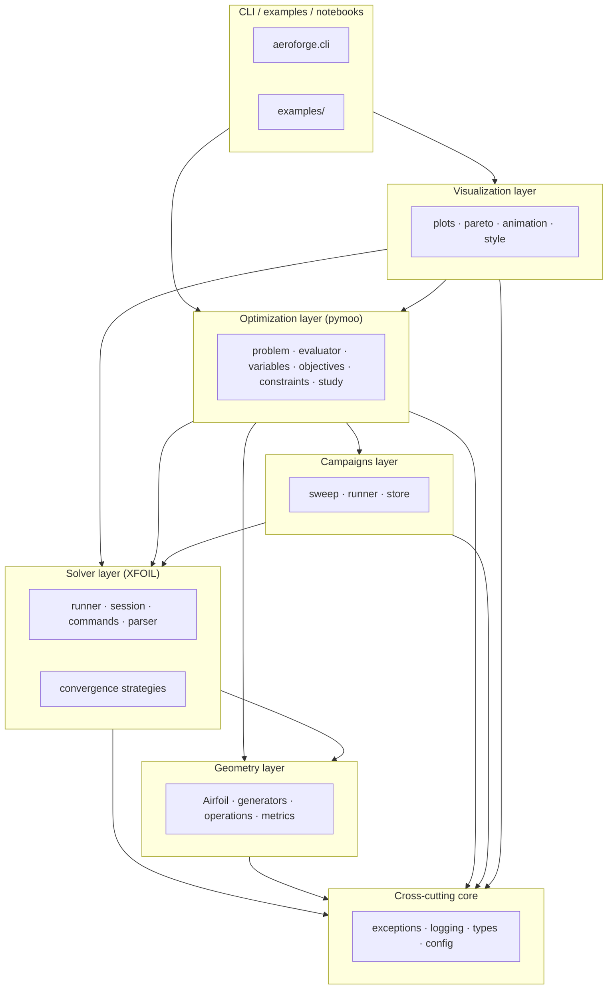

# aeroforge — Architecture & Design

> A professional, object-oriented Python toolkit for 2D airfoil aerodynamics
> built around XFOIL, with a generic shape-optimization layer (pymoo) and a
> portfolio-grade visualization pipeline.

This document is the project's design source-of-truth. It covers the
architecture, the directory layout, the modules and classes, the design
patterns, the public interfaces, the development roadmap, the dependency
choices, the testing strategy, the visualization/animation strategy, and the
Git/GitHub workflow. The shape of the code on disk follows this document
exactly; if the two ever disagree, the document is the bug.

---

## 1. Goals and non-goals

### Goals

- Provide a **robust, scriptable, extensible** Python interface to XFOIL that
  hides the binary's quirks (stdin command grammar, scratch files, occasional
  hangs, non-convergence) behind a typed, object-oriented API.
- Treat **geometry, solver, optimization, and visualization** as four cleanly
  separated layers, each programming against the next layer's abstractions
  rather than against concrete classes.
- Make it **trivial to add** a new airfoil parameterization, a new convergence
  strategy, a new objective, or a new plot — without modifying existing code
  (open/closed principle).
- Ship a **professional repository**: PEP 8 + Google docstrings, full typing,
  CI, pre-commit hooks, semantic versioning, conventional commits, mkdocs API
  docs, and reproducible examples.
- Produce **portfolio-grade visual deliverables** (GIFs / MP4s of design
  evolution and Pareto-front progression) directly from optimization runs.

### Non-goals

- Replacing XFOIL itself, or writing a new viscous panel solver from scratch.
- Wrapping the entire XFOIL feature surface. We expose the subset that is
  needed for clean polar/Cp/transition analyses and shape optimization.
- 3D wings, full Navier–Stokes CFD, or unsteady simulations. Those are
  out of scope; we stay strictly 2D / steady-state.

---

## 2. High-level architecture

The library is organised in four layers. Each layer depends only on the
layers below it and on the cross-cutting `core` package.



Two architectural rules keep this manageable:

1. **No upward imports.** A lower layer never imports from a higher one. This
   guarantees that the geometry engine can be used standalone (e.g. on a
   minimal HPC node) and that the optimization layer can be swapped for a
   different framework without rewriting the solver.
2. **Optional dependencies are isolated.** Heavy/optional packages (pymoo,
   matplotlib, typer) are confined to their layer and pulled in via `pip`
   extras. The top-level `import aeroforge` works with only NumPy installed.

---

## 3. Repository layout

```
airfoil_optimization/                  # Git repo root
├── .github/
│   └── workflows/
│       ├── ci.yml                     # lint + type-check + multi-OS test matrix
│       └── docs.yml                   # mkdocs deploy on main
├── docs/                              # mkdocs-material site source
│   └── index.md
├── examples/                          # runnable end-to-end scripts
│   ├── 01_generate_airfoil.py
│   ├── 02_run_polar.py
│   └── 03_optimize_ld.py
├── src/
│   └── aeroforge/                     # the package (src layout)
│       ├── __init__.py                # lightweight public surface
│       ├── config/
│       │   ├── defaults.py            # constants tunable in one place
│       │   └── settings.py            # pydantic-settings (env vars / .env)
│       ├── core/
│       │   ├── exceptions.py          # AeroforgeError hierarchy
│       │   ├── logging.py             # configure_logging / get_logger
│       │   └── types.py               # FloatArray, OperatingPoint, enums
│       ├── geometry/
│       │   ├── airfoil.py             # Airfoil value object
│       │   ├── metrics.py             # thickness / camber / area helpers
│       │   ├── operations/
│       │   │   ├── discretize.py      # cosine spacing, repaneling
│       │   │   ├── smoothing.py       # Savitzky-Golay (planned)
│       │   │   └── transforms.py      # translate / scale / rotate
│       │   └── generators/
│       │       ├── base.py            # AirfoilGenerator ABC
│       │       ├── naca4.py           # NACA 4-digit (implemented)
│       │       ├── parametric.py      # CST / Bezier / PARSEC (planned)
│       │       └── from_file.py       # DatFileGenerator
│       ├── solver/
│       │   ├── base.py                # AbstractSolver ABC
│       │   ├── xfoil/
│       │   │   ├── commands.py        # XfoilCommand fluent builder
│       │   │   ├── session.py         # XfoilSession (declarative run)
│       │   │   ├── runner.py          # XfoilRunner (subprocess driver)
│       │   │   ├── parser.py          # output parsers
│       │   │   └── results.py         # PolarPoint / Polar / CpDistribution
│       │   └── convergence/
│       │       ├── base.py            # ConvergenceStrategy ABC
│       │       ├── strategies.py      # concrete strategies
│       │       └── pipeline.py        # chain-of-responsibility
│       ├── campaigns/
│       │   ├── sweep.py               # parametric Cartesian product
│       │   ├── runner.py              # parallel CampaignRunner
│       │   └── store.py               # ResultStore (parquet / sqlite)
│       ├── optimization/              # requires the ``optim`` extra
│       │   ├── variables.py           # DesignSpace / DesignVariable
│       │   ├── objectives.py          # Objective ABC + factories
│       │   ├── constraints.py         # geometric & physical constraints
│       │   ├── penalties.py           # quadratic / linear / exponential
│       │   ├── evaluator.py           # AirfoilEvaluator (the bridge)
│       │   ├── problem.py             # pymoo Problem adapter
│       │   ├── algorithms.py          # NSGA-II/III, GA factories
│       │   ├── callbacks.py           # HistoryCallback for animations
│       │   └── study.py               # OptimizationStudy facade
│       ├── visualization/             # requires the ``viz`` extra
│       │   ├── style.py
│       │   ├── plots.py
│       │   ├── pareto.py
│       │   └── animation.py
│       └── cli/
│           └── main.py                # typer entrypoint (aeroforge ...)
├── tests/
│   ├── conftest.py
│   ├── unit/                          # fast, no XFOIL binary required
│   ├── integration/                   # require the real XFOIL binary
│   └── data/                          # canned fixtures (polars, .dat files)
├── pyproject.toml                     # build, deps, ruff, black, mypy, pytest
├── README.md
├── ARCHITECTURE.md                    # this file
├── CONTRIBUTING.md
├── CHANGELOG.md
├── LICENSE                            # MIT
├── Makefile                           # make dev / lint / test / cov / docs
├── mkdocs.yml
├── .gitignore
└── .pre-commit-config.yaml
```

The **src/ layout** is deliberate: it forces `pip install -e .` for local
development so tests run against the installed package, not a path-relative
fork. This catches packaging mistakes early (missing `__init__.py`, wrong
entry-point name, missed re-export).

---

## 4. Module map and main classes

### 4.1 `aeroforge.core` — cross-cutting foundations

| Symbol | Purpose |
|---|---|
| `AeroforgeError` (+ hierarchy) | Single base for all library exceptions, so callers can `except AeroforgeError` once and still discriminate by subtype (`ConvergenceError`, `XfoilNotFoundError`, `InvalidAirfoilError`, ...). |
| `configure_logging` / `get_logger` | Library-wide logging conventions; the library is silent by default (NullHandler) and only emits output once an application opts in. |
| `FloatArray` | Type alias for `npt.NDArray[np.float64]`, used uniformly. |
| `OperatingPoint` | Frozen dataclass: `alpha`, `reynolds`, `mach`, `n_crit`, optional forced-transition locations. The single vocabulary every layer uses to describe an aerodynamic state. |
| `Surface`, `TrailingEdge` | Enums for upper/lower and open/closed TE conventions. |
| `Settings` | `pydantic_settings.BaseSettings` reading `AEROFORGE_*` env vars and `.env`. Validated, frozen, cached via `get_settings()`. |

### 4.2 `aeroforge.geometry` — the airfoil model

| Symbol | Purpose |
|---|---|
| `Airfoil` | Immutable-by-convention value object holding Selig-ordered `(x, y)` arrays. Exposes derived metrics (`max_thickness`, `max_camber`, `area`, ...), I/O (`to_dat`, `from_dat`), and pure transforms (`translated`, `scaled`, `rotated`, `normalized`) returning new instances. |
| `AirfoilGenerator` (ABC) | The single contract every shape producer satisfies. Has one method, `generate() -> Airfoil`. |
| `NACA4Generator` | First concrete generator, **fully implemented and tested**. Parses the `MPXX` designation, applies the closed-TE thickness polynomial, and merges surfaces in Selig order. |
| `CSTGenerator`, `BezierGenerator`, `PARSECGenerator` | Stubs with stable signatures; implementations land in M3. |
| `DatFileGenerator` | Loads an `.dat` file, optionally repanels it to a target node count. |
| `metrics.*` | Pure NumPy helpers (`split_surfaces`, `max_thickness`, `max_camber`, `enclosed_area`, `trailing_edge_gap`). The `Airfoil` class delegates to these so the formulas are not duplicated. |
| `operations.*` | Pure functions for `cosine_spacing`, `linear_spacing`, `repanel` (lazy SciPy import), `translate`, `scale`, `rotate`, `smooth_savgol` (planned). |

### 4.3 `aeroforge.solver` — XFOIL wrapper

The solver layer is intentionally cut into **small, single-purpose pieces** so
each can be unit-tested in isolation. The `XfoilRunner` is the only place that
owns a subprocess; everything above it deals in pure data.

| Symbol | Purpose |
|---|---|
| `AbstractSolver` | The minimal contract: `analyze(airfoil, point) -> PolarPoint`. Optimization and campaigns talk to this, never to `XfoilRunner` directly. |
| `XfoilRunner` | Concrete `AbstractSolver`. Discovers the binary (`shutil.which`), creates a scratch directory, writes the airfoil `.dat`, pipes a command transcript via `subprocess.run`, enforces a hard timeout, parses output, and translates failures into typed exceptions. |
| `XfoilSession` | Declarative description of one run (airfoil + operating points + max_iter + n_crit + repanel). Renders itself to a stdin transcript. Lets us snapshot the *intended* XFOIL run as data, which is valuable for caching and reproducibility. |
| `XfoilCommand` | Fluent builder for XFOIL's idiosyncratic stdin command grammar. Centralises command emission so command-string typos cannot proliferate. |
| `XfoilOutputParser` | Stateless parsers for `PACC` polar dumps and `CPWR` Cp dumps. Test fixtures live in `tests/data/`. |
| `PolarPoint`, `Polar`, `CpDistribution` | Typed result containers (`@dataclass(frozen=True, slots=True)`). |
| `ConvergenceStrategy` (ABC) | One technique to coax XFOIL into converging. Implementations: `IncreaseIterationsStrategy`, `AlphaContinuationStrategy`, `InviscidInitStrategy`, `RepanelStrategy`, `PerturbAlphaStrategy`. |
| `ConvergencePipeline` | A `ConvergenceStrategy` that chains other strategies (chain-of-responsibility). Returns the first success; raises `ConvergenceError` only if every strategy fails. |

### 4.4 `aeroforge.campaigns` — sweeps and batch execution

| Symbol | Purpose |
|---|---|
| `Sweep` | Cartesian product over named parameter ranges; a `factory` callable maps each tuple to `(Airfoil, OperatingPoint)`. Lets callers script complex sweeps without writing nested loops. |
| `CampaignRunner` | Drives a sweep through a solver, optionally with a `ConvergencePipeline` for retries, optionally with a `ResultStore` for resumable persistence, optionally with `n_workers` for process-level parallelism. |
| `ResultStore` (ABC) + `ParquetResultStore` / `SqliteResultStore` | Idempotent persistence keyed by `(airfoil_hash, OperatingPoint)`. Resumable: when re-launched, the runner skips already-stored evaluations. |

### 4.5 `aeroforge.optimization` — pymoo bridge

| Symbol | Purpose |
|---|---|
| `DesignVariable`, `DesignSpace` | Frozen value objects with hard bounds, `to_mapping` to convert a genome vector to a name-keyed dict, `bounds` to expose `(xl, xu)` to pymoo. |
| `Objective` (ABC) + `MinimizeDrag`, `MaximizeLift`, `MaximizeLiftToDrag` | pymoo minimises, so maximising objectives return negated values. |
| `GeometricConstraint` / `PhysicalConstraint` (ABCs) + `MinThicknessConstraint`, `MinPitchingMomentConstraint`, ... | Follow pymoo's "`g <= 0` is feasible" convention. Two ABCs so we can cheaply prune candidates on geometry before paying for an XFOIL call. |
| `penalties.{quadratic,linear,exponential}_penalty` | Closures returning a `g -> penalty` callable, for the soft-constraint variant. |
| `AirfoilEvaluator` | The bridge: genome -> `airfoil_factory(params)` -> geometric constraints -> solver -> objectives + physical constraints. Returns `(F, G)`. |
| `AirfoilProblem` | `pymoo.core.problem.Problem` adapter that forwards `_evaluate` calls to the evaluator. |
| `algorithms.{nsga2, nsga3, ga}` | Configured-by-default factories returning pymoo algorithm instances. |
| `HistoryCallback`, `GenerationSnapshot` | Capture `(X, F, G)` after each generation; feeds the animation pipeline. |
| `OptimizationStudy` | High-level facade: `study.run()` to launch, `study.resume()` to continue from a checkpoint. |

### 4.6 `aeroforge.visualization` — figures and animations

| Symbol | Purpose |
|---|---|
| `use_portfolio_style`, `PORTFOLIO_PALETTE` | Centralised matplotlib `rcParams` so every figure has a consistent identity. |
| `plot_geometry`, `plot_polar`, `plot_cp`, `plot_convergence_history` | Static plot generators. Each takes an optional `ax` and never calls `plt.show()`. |
| `plot_pareto_front` | Front rendering from a `GenerationSnapshot`. |
| `animate_geometry_evolution`, `animate_pareto_evolution` | Turn a `HistoryCallback` into GIF/MP4. Driven by `imageio` (+ `imageio-ffmpeg` for video). |

### 4.7 `aeroforge.cli`

Built on `typer`. Subcommands map to high-level use cases (`airfoil naca`,
`polar run`, `optimize run`). The CLI is the polished entry point for
portfolio reviewers who want to *see something happen* without writing
Python.

---

## 5. Design patterns

The patterns below were chosen deliberately and each pulls real weight.

### 5.1 Strategy

- `AirfoilGenerator` (interchangeable shape parameterizations).
- `ConvergenceStrategy` (interchangeable XFOIL recovery techniques).
- `Objective` / `GeometricConstraint` / `PhysicalConstraint` (interchangeable
  optimization criteria).

Strategies are stateless across calls and trivially composable. They let the
optimization layer be written against the **interface**, so adding a new
shape parameterization or convergence trick is a one-file change — never a
modification of existing classes.

### 5.2 Chain of Responsibility

`ConvergencePipeline` is itself a `ConvergenceStrategy` that delegates to a
list of children in order. The first child that converges wins; only if all
fail does the pipeline raise. This is the cleanest expression of *"try this,
then this, then give up"* and it keeps the recovery policy declarative.

### 5.3 Builder (fluent)

`XfoilCommand` is a fluent builder for stdin command transcripts. The fluent
chaining matches the way humans describe an XFOIL session ("load, repanel,
oper, viscous Re, iter, alpha sweep, save") and the centralisation means a
typo in `"VISC"` happens **once**.

### 5.4 Adapter

`AirfoilProblem` adapts an `AirfoilEvaluator` to pymoo's `Problem` API. The
adapter pattern keeps the rest of the library free of pymoo types — switch
optimization frameworks later by writing a new adapter, not by rewriting the
evaluator.

### 5.5 Facade

`OptimizationStudy` is a small facade around evaluator + algorithm + history
+ checkpoint, so users can launch a multi-objective optimization in two
lines without touching pymoo's internals.

### 5.6 Value object

`Airfoil`, `OperatingPoint`, `PolarPoint`, `DesignVariable`, `GenerationSnapshot`,
... are all small, immutable-by-convention value objects. They make the
codebase comfortable to reason about: equality is structural, no spooky
action at a distance.

### 5.7 Dependency injection

`AirfoilEvaluator`, `CampaignRunner`, and `OptimizationStudy` take their
collaborators (`solver`, `convergence`, `store`, `airfoil_factory`, ...) by
argument. No singletons, no module-level state. This is what makes unit
testing with fakes feasible.

### 5.8 Lazy import

Optional dependencies (`scipy`, `pymoo`, `matplotlib`, `imageio`, `typer`)
are imported inside the function or method that needs them. The package's
top-level import stays cheap and works in stripped-down environments.

---

## 6. Object interfaces (the contracts)

The library's public surface stabilises around four small ABCs. Every concrete
class implements exactly one of these, and the rest of the library programs
against the ABCs.

```python
class AirfoilGenerator(ABC):
    @abstractmethod
    def generate(self) -> Airfoil: ...
    @property
    def name(self) -> str: ...

class AbstractSolver(ABC):
    @abstractmethod
    def analyze(self, airfoil: Airfoil, point: OperatingPoint) -> PolarPoint: ...

class ConvergenceStrategy(ABC):
    @abstractmethod
    def attempt(
        self,
        solver: AbstractSolver,
        airfoil: Airfoil,
        point: OperatingPoint,
        *,
        history: list[PolarPoint],
    ) -> PolarPoint: ...

class Objective(ABC):
    @abstractmethod
    def evaluate(self, result: PolarPoint) -> float: ...
```

`GeometricConstraint` and `PhysicalConstraint` follow the same shape as
`Objective` (one `evaluate` method, returning a `<= 0`-is-feasible scalar).

Note how *no* abstract method takes a pymoo type, a matplotlib axes, or a
subprocess handle. The contracts are framework-agnostic; the integrations
live on the concrete side.

---

## 7. Development roadmap

Milestones are sized to ship **a usable thing** at each step rather than a
slice of every layer.

### M1 — Geometry foundation *(this scaffold; current state)*

- Repository scaffolded with src layout, pyproject, CI, pre-commit, mkdocs.
- `core` package complete (exceptions, logging, types, settings).
- `geometry` package: `Airfoil`, `NACA4Generator` (**implemented + tested**),
  `DatFileGenerator`, cosine/linear/repanel operations, affine transforms,
  metric helpers. CST/Bézier/PARSEC stubs.
- All higher layers scaffolded with stable public interfaces.

### M2 — Working XFOIL wrapper

- `XfoilRunner` end-to-end: binary discovery, scratch dir, stdin transcript,
  subprocess timeout, output parsing.
- `XfoilOutputParser` polar + Cp implementations, fixture-tested on canned
  XFOIL dumps in `tests/data/`.
- Concrete convergence strategies wired up (`IncreaseIterationsStrategy`,
  `AlphaContinuationStrategy`, `InviscidInitStrategy`, `RepanelStrategy`,
  `PerturbAlphaStrategy`).
- Integration tests behind the `integration` pytest marker (skip when
  `xfoil` is not on `PATH`).
- Examples 02/03 runnable end-to-end.

### M3 — Optimization

- `AirfoilEvaluator.evaluate` complete (geometric prune -> solver call ->
  physical constraints -> objectives), with `EvaluationError` translation.
- `AirfoilProblem._evaluate` driving the evaluator across a pymoo population.
- `OptimizationStudy.run` + `resume` with checkpointing.
- Examples: single-objective L/D maximisation on NACA 4 and CST design spaces.

### M4 — Campaigns

- `CampaignRunner` with serial and `multiprocessing.Pool`-backed parallel
  execution.
- `ParquetResultStore` and `SqliteResultStore` with `(airfoil_hash, point)`
  idempotency.
- Resume-from-checkpoint end-to-end demo: kill, restart, finish without
  recomputing converged points.

### M5 — Visualization & portfolio assets

- All `plot_*` and `animate_*` functions implemented.
- A reproducible demo script that produces `docs/assets/geometry.gif`,
  `docs/assets/pareto.gif`, `docs/assets/polar.png` from a single
  optimization run. These assets land on the portfolio site
  (`vcaries.github.io`) and the README.

### M6 — Polish & release

- mkdocs API reference auto-deploying on push to `main`.
- 90%+ unit-test coverage on `core`, `geometry`, parsers, and pipeline.
- v0.1.0 tag with full CHANGELOG, conventional commits enforced.

### M7+ — Stretch

- Surrogate-assisted optimization (Kriging on cheap geometric metrics).
- Multi-fidelity bridge (e.g. panel-method preview before XFOIL).
- Web UI / Streamlit dashboard for the portfolio.

---

## 8. Dependencies

Runtime dependencies are kept lean so the core library installs on a clean
Python 3.10 with no compiler in sight. Optional capabilities live in `pip`
extras.

### Runtime (always installed)

| Package | Why |
|---|---|
| `numpy >= 1.24` | The data substrate. Everything geometric, every solver result, every constraint runs through NumPy arrays. |
| `scipy >= 1.10` | Used lazily by `repanel` (spline interpolation) and by some convergence-helper math. Lazy-imported so `aeroforge.geometry` works without it on the hot path. |
| `pydantic >= 2.5` | Validation backbone for typed configuration. |
| `pydantic-settings >= 2.1` | Environment / `.env` settings loader. |

### Extras

| Extra | Packages | Purpose |
|---|---|---|
| `optim` | `pymoo >= 0.6.1` | The optimization layer. |
| `viz` | `matplotlib`, `imageio`, `imageio-ffmpeg` | Static plots and GIF/MP4 animations. |
| `io` | `pandas`, `pyarrow` | Result-store / DataFrame integration. |
| `cli` | `typer`, `rich` | Polished command-line interface. |
| `all` | meta-extra: `optim + viz + io + cli` | One-liner full install. |

### Development

`ruff` (lint + import sort + format check), `black` (formatter), `mypy`
(static typing, strict-ish, pydantic plugin enabled), `pytest`,
`pytest-cov`, `pytest-mock`, `hypothesis` (property-based tests for
geometry), `pre-commit`, `mkdocs-material` + `mkdocstrings[python]` (docs).

External (non-pip) tool: the **XFOIL** binary, required at runtime by the
solver layer (but never imported / installed by pip). Integration tests are
gated on its presence.

---

## 9. Testing strategy

A pyramid of tests, with the bulk at the fastest, cheapest level.

### 9.1 Unit tests (`tests/unit/`)

- **Pure-NumPy and pure-logic code, no XFOIL.** Geometry generators,
  metrics, transforms, parsers (against canned fixtures), command builder,
  convergence pipeline (with fake strategies).
- Run on every push, every PR, on Linux + Windows, Python 3.10 / 3.11 / 3.12.
- Marker: implicit (default test path).
- Target: full pass in **< 5 seconds** on a developer laptop. Coverage
  target: **≥ 90 %** in `core`, `geometry`, `solver.xfoil.commands`,
  `solver.xfoil.parser`, `solver.convergence.pipeline`.

### 9.2 Property-based tests (`hypothesis`)

- For shape-invariant properties of generators: e.g. *every NACA 4 airfoil
  has positive thickness on `(0, 1)`*, *normalize is idempotent up to
  floating-point tolerance*, *cosine_spacing is monotonic*. Property tests
  shake out edge cases unit tests routinely miss.

### 9.3 Integration tests (`tests/integration/`)

- **Require the real XFOIL binary.** Marker: `integration`. Skipped when
  `shutil.which("xfoil") is None` so CI without XFOIL passes cleanly.
- Cover: viscous solve on NACA 0012 at `Re = 1e6`, polar sweep through
  stall, non-convergence -> recovery via `ConvergencePipeline`, Cp dump
  round-trip.

### 9.4 Optimization smoke tests (slow, opt-in)

- Marker: `slow`. Tiny pymoo run (3 generations, pop 8) to verify the
  end-to-end pipeline. Not run on every push.

### 9.5 Test fixtures

- `tests/data/` holds canned XFOIL output files used by `XfoilOutputParser`
  tests. Lets parser tests run without the binary.
- `tests/conftest.py` exposes `naca_0012`, `naca_2412`, and `temp_dat_file`
  fixtures.

### 9.6 Style and typing as tests

- `ruff check` and `ruff format --check` are mandatory in CI.
- `mypy src` is mandatory in CI (`disallow_untyped_defs = true`).
- Pre-commit hooks enforce the same locally; the CI is a safety net, not the
  primary gate.

---

## 10. Visualization & animation strategy

The visualization layer is what turns the project from "engineering exercise"
into "portfolio asset". The goal is figures and clips clean enough to drop
straight onto `vcaries.github.io` without rework.

### Static figures

- One centralised matplotlib style (`use_portfolio_style`): colour-blind
  safe palette, sans-serif font, light grid, suppressed top/right spines,
  150 dpi savefig.
- Every plot function accepts an `ax` and returns the `Axes`. This makes
  multi-panel figures (e.g. *geometry + polar + Cp* side-by-side) trivial
  to compose.
- Standard plots:
  - **Geometry**: contour + chord line + LE/TE markers, 1:1 aspect.
  - **Polar**: a two-panel `(Cl/alpha, Cl/Cd)` figure with stall corner
    annotated.
  - **Cp distribution**: inverted y-axis (convention), upper/lower as two
    series, optional transition markers.
  - **Convergence history**: best-so-far and population-average over
    iterations / generations.

### Animations

The animation pipeline is the centrepiece of the portfolio payoff. It
consumes a `HistoryCallback` populated during an optimization run and emits:

| Asset | Per frame | Output |
|---|---|---|
| Geometry evolution | Current best-so-far airfoil contour (and optionally the previous best in faded outline). | `geometry.gif` |
| Pareto-front advance | Scatter of population in `(f1, f2)`, with the non-dominated front highlighted. | `pareto.gif` |
| Cp evolution | Cp distribution of the current best at a fixed operating point. | `cp.mp4` |
| Metric trajectory | Best-so-far / population statistics on each objective. | `metrics.gif` |

Implementation notes:

- We use `imageio` to write GIFs and `imageio-ffmpeg` for MP4. We render
  each frame with matplotlib to an in-memory `Figure`, save it to a
  `BytesIO`, append it to the writer, and close the figure to keep peak
  memory bounded (this matters for 200+ generation studies).
- Frame rate defaults to **12 fps**: fast enough to read smooth motion,
  slow enough that a 50-generation run produces a watchable 4-second clip.
- The pipeline is deterministic given the same `HistoryCallback`, so all
  portfolio assets are reproducible from a single `make demo`.

---

## 11. Git / GitHub strategy

The repository is meant to read like a senior engineer's portfolio
artefact. The workflow below reflects that — lightweight but disciplined.

### Branching

- **`main`** is always releasable and is protected: required CI green,
  required PR review (or a "self-approve" when working solo), squash
  merges only.
- **`develop`** (optional) is used only if releases need to bake before
  promotion. For a solo project, `main` alone is fine.
- **Topic branches** are short-lived, scoped to one logical change:
  - `feat/<short-name>` — new capability.
  - `fix/<short-name>` — bug fix.
  - `refactor/<short-name>` — non-behavioural change.
  - `docs/<short-name>` — docs only.
  - `test/<short-name>` — tests only.
- Branches **never** live more than a few days. If a feature is bigger,
  break it into PR-sized slices (e.g. M2 ships as five PRs, not one).

### Commits — Conventional Commits

```
<type>(<scope>): <imperative summary>

<body if needed: what changed and *why*. Wrap at 72 chars.>

<footer: Refs #123, BREAKING CHANGE: ...>
```

Types: `feat`, `fix`, `refactor`, `perf`, `docs`, `test`, `chore`, `build`,
`ci`. Scope is the package or subpackage (`geometry`, `solver`, `optim`,
`ci`, ...). This format keeps `git log` skimmable and unlocks automatic
changelog generation later.

### Pull requests

PRs follow a small template:

- **What** changed.
- **Why** (link to issue or roadmap milestone).
- **How to verify** (commands, expected output).
- **Out of scope** (anything intentionally left for follow-up).

PRs target `main`, must be green in CI, and squash-merge. The squashed
commit's subject must respect Conventional Commits.

### Releases

- **SemVer**. While on `0.x.y`, breaking changes bump the `y` digit but
  are still called out as `BREAKING CHANGE:` in the commit footer.
- Releases are tagged `vMAJOR.MINOR.PATCH` and published as GitHub
  Releases; the release notes are generated from the `CHANGELOG.md`.
- `CHANGELOG.md` follows *Keep a Changelog* with an `[Unreleased]`
  section that gets renamed on tag.

### Protection & quality bar

- Pre-commit hooks (`ruff`, `ruff-format`, `mypy`, trailing-whitespace, ...)
  installed via `make dev`. Every contributor's first commit is locally
  formatted.
- CI (`.github/workflows/ci.yml`): lint + type-check job + matrix of
  `{ubuntu-latest, windows-latest} × {3.10, 3.11, 3.12}` running unit
  tests. Coverage uploaded to Codecov (informational, not blocking).
- A separate `docs.yml` deploys mkdocs to GitHub Pages on every push to
  `main`.

### Issue hygiene

- Issues use labels: `area/<layer>`, `kind/<bug|feat|docs|test>`,
  `prio/<low|mid|high>`, `good first issue`. Milestones map to the M1–M6
  roadmap above.
- Roadmap items above each get an issue once we start work on them, so
  the GitHub project board reflects the same plan as this document.

---

## 12. Performance and robustness considerations

A few decisions worth recording because they constrain implementation later.

### Hot path

`AirfoilEvaluator.evaluate` is the hot path: a typical study runs it
`pop_size * n_gen` times (e.g. 40 × 50 = 2000) and each call performs an
XFOIL solve, which dominates wall-clock time. Optimisations:

- Cheap **geometric constraints first** (`MinThicknessConstraint`, etc.),
  before ever shelling out to XFOIL. Save the expensive call for candidates
  that already pass cheap checks.
- **Process-level parallelism** in `CampaignRunner`: each XFOIL invocation
  is its own subprocess, so `multiprocessing.Pool(processes=N)` scales near
  linearly until the disk I/O for scratch files becomes the bottleneck.
- **Result caching** via `ResultStore`: the same `(airfoil_hash, point)` is
  never re-evaluated. Useful for resuming and for tweak-and-retry workflows
  on the same population.

### Robustness

- Every shell-out has a **hard timeout** (`process_timeout_s`). XFOIL hangs
  exist in the wild; we never let one hang the campaign.
- Non-convergence is **expected**, not exceptional. The `ConvergencePipeline`
  treats `ConvergenceError` as routine and tries fallbacks. Only a final
  failure surfaces as `EvaluationError`.
- The `Airfoil` constructor validates aggressively (mismatched shapes, NaN
  values, fewer than four points). Better a clean `InvalidAirfoilError` at
  the front door than a mysterious solver crash three layers down.
- Subprocess stdout/stderr capture is always on; on failure, the failing
  XFOIL transcript is included in the exception message for triage.

### Determinism

- Optimization runs accept a `seed`. Same seed + same evaluator + same
  algorithm config -> bit-identical `HistoryCallback`. This is what makes
  the portfolio assets reproducible.

---

## 13. Extension recipes

Three concrete walk-throughs of how the architecture pays off.

### Recipe A — add a new shape parameterization

Suppose I want a "Hicks–Henne bump" generator on top of an existing baseline.

1. Create `src/aeroforge/geometry/generators/hicks_henne.py`.
2. Subclass `AirfoilGenerator`. Take the baseline `Airfoil` and a vector of
   bump amplitudes / widths in `__init__`. Implement `generate()` by adding
   sine-bump perturbations to the baseline surfaces.
3. Re-export from `geometry/generators/__init__.py`.
4. Optimisation, campaigns, visualization: **no change**, because they
   program against `AirfoilGenerator`.

### Recipe B — add a new convergence strategy

Suppose XFOIL is failing near stall and a "halve alpha step + boost iter"
combo would help.

1. Create `HalfStepBoostIterStrategy(ConvergenceStrategy)` in
   `solver/convergence/strategies.py`.
2. Add it to your pipeline: `ConvergencePipeline([base, alpha_continuation,
   HalfStepBoostIterStrategy()])`.
3. The `CampaignRunner` and `XfoilRunner` see no code change.

### Recipe C — add a new objective

Suppose we want to penalise leading-edge suction-peak severity.

1. Create `MinSuctionPeak(Objective)` in `optimization/objectives.py` whose
   `evaluate(result)` reads the Cp distribution (we extend `PolarPoint` to
   carry it, or wrap a richer result type).
2. Add it to the evaluator's `objectives=[...]` list.
3. `AirfoilProblem.n_obj` auto-updates from the evaluator. No further
   change.

These three recipes each touch exactly **one** new file. That is the test
the architecture is meant to pass.

---

## 14. Status snapshot

| Layer | Sub-area | State |
|---|---|---|
| `core` | exceptions, logging, types | ✅ implemented |
| `core` | settings (pydantic) | ✅ implemented |
| `geometry` | `Airfoil` value object | ✅ implemented + tested |
| `geometry` | `NACA4Generator` | ✅ implemented + tested |
| `geometry` | `DatFileGenerator` | ✅ implemented |
| `geometry` | cosine/linear/repanel/transforms | ✅ implemented (smoothing planned) |
| `geometry` | CST / Bézier / PARSEC | 🔲 interface scaffolded |
| `solver.xfoil` | command DSL, session | ✅ implemented |
| `solver.xfoil` | `XfoilRunner` (subprocess), parser | 🔲 scaffolded — M2 |
| `solver.convergence` | strategies & pipeline | 🔲 scaffolded — M2 |
| `campaigns` | sweep / runner / store | 🔲 scaffolded — M4 |
| `optimization` | variables, objectives, constraints, penalties | ✅ implemented (skeletons) |
| `optimization` | evaluator, problem, study | 🔲 scaffolded — M3 |
| `visualization` | style + palettes | ✅ implemented |
| `visualization` | plots / pareto / animation | 🔲 scaffolded — M5 |
| `cli` | typer app | ✅ minimal (`airfoil naca` works) |
| project | CI, pre-commit, ruff/black/mypy/pytest | ✅ wired |
| project | mkdocs docs site | ✅ skeleton |
| project | CHANGELOG, CONTRIBUTING, README | ✅ |

Legend: ✅ done · 🔲 interface stable, implementation pending.

---

## 15. Open questions / future work

- **Surrogate-assisted optimization**. For a 40 × 50 study, an XFOIL
  evaluation costs ~1 s, so a full run is ~30 min. A Gaussian-process
  surrogate over cheap geometric features could prune 70 %+ of candidates,
  bringing studies down to minutes. Out of scope for v0.1.
- **JAX-friendly geometry generators** for differentiable shape
  optimization. Possible in M7+; needs a separate `Airfoil` view.
- **Web UI**. A small Streamlit / Dash dashboard could turn the project
  into an interactive portfolio piece. The CLI already provides the
  scriptable surface that a UI would call into.
- **Multi-point objectives**. Real airfoil design optimises across an
  *envelope* of operating points, not just one. The `Objective` interface
  should grow a list-of-points variant in M3, weighted as a single scalar.

---

*Maintained alongside the code. If this document is wrong, please update it
in the same PR as the code change.*
